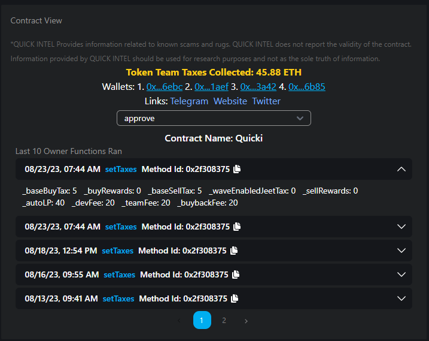

# 📄 Other Features

## Viewing Scan Results

Let's go through the various bits of information and break it down!

### Wallet Distribution

Understanding the token distribution of the Top 10 wallets is critical to understanding if there could be a large supply held, which could cause unnecessary damage to a chart. We break down those holders in an easy-to-view chart.

<figure><figcaption></figcaption></figure>

### Contract View

There are cases where some more tech-savvy users will want to dive deeper into information about a token or its contract. In the contract view, we list out a few additional data points to enhance your DYOR.

<figure><figcaption></figcaption></figure>

1. (All Access Tier Feature) - View the total taxes collected by that particular token. This helps you see if a project could potentially be tax farming.
2. Links (Basic+ Tier and above) - This will display links that are embedded into the contract's code, making it a touch easier to find socials related to new projects.
3. Functions and Full Contract - Lists the functions the contract has available
4. Last 10 Owner Functions Ran - Lists the last 10 functions the owner has called.  It is typical to see taxes, liquidity add/remove, and other similar calls.

