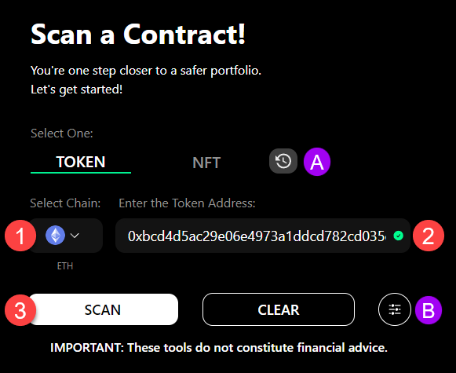

# 🔌 Scan A Contract

## Running a Scan

### Input Chain and Token Information

Scanning a token is simple and easy once you are on the Quick Intel Scan page.

&#x20;<mark style="color:red;">**1.**</mark> Select the chain of the token you want to scan. (Ex. Ethereum)

&#x20;<mark style="color:red;">**2.**</mark> Paste the contract address you want to scan.

&#x20;<mark style="color:red;">**3.**</mark> <mark style="color:yellow;">Select SCAN!</mark>

<figure><figcaption>
Quick Intel - Scan a Token
</figcaption></figure>

&#x20;Other items on this page:

* <mark style="color:purple;">**A.**</mark> Quickly go back to previous scans by clicking here
  * Basic+ sees the last 5 scans
  * All Access sees the last 10 scans
* <mark style="color:purple;">**B.**</mark>  If you need to set a non-standard DEX/Pairing, click here for additional settings

