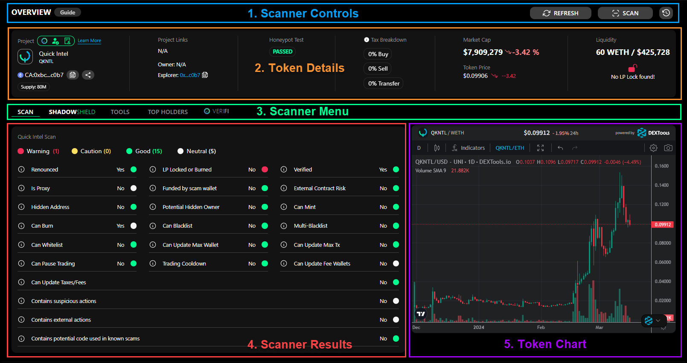

# 🗺️ Scanner Overview

## Scanner Sections

<figure><figcaption></figcaption></figure>

## <mark style="color:blue;">1. Scanner Controls</mark>

* View the welcome guide, which steps you through the scanner page
* Refresh the current scan's information
* Scan a new token
* See your scanning history (if logged in; # of scans displayed is dependent on your holder Tier)

## <mark style="color:orange;">2. Token Details</mark>

* Token supply
* Token owner
* Project links (Included in Basic+ and All Access Tiers)
* Honeypot test to ensure you can sell your tokens
* Buy / Sell / Transfer Taxes
* Current Market Cap and Token Price
* Liquidity and LP lock/burn information


**See** [token-details.md](token-details.md "mention") **for more insight into this section!**


## <mark style="color:green;">3. Scanner Menu</mark>

* SCAN - Displays the scanner results
* SHADOWSHIELD - Displays the ShadowShield AI scam prediction
* TOOLS - Displays recently run owner actions, as well as similar and exact token matches
* TOP HOLDERS - Show the top 10 holders of the token
* VERIFI - Displays KYC & Official Audits of the token (project must have opted into VERIFI)

## <mark style="color:red;">4. Scanner Results</mark>

* Quickly see what a contract is capable of so you are not caught off-guard.


**See** [scanner-results.md](scanner-results.md "mention") **for more insight into this section!**


## <mark style="color:purple;">5. Token Chart</mark>

We know how important it is to see a token's chart easily. So, we've made it simple for you! Now, you can quickly check out the token's chart when scanning. You can easily open the chart in a new tab if you want to look closer and use more detailed chart tools. This way, you get the best of both worlds without any hassle.
