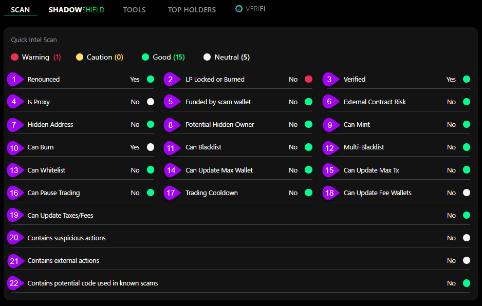

# 👁️ Scanner Results

## Results Deep Dive

The Quick Intel Audit is designed to swiftly analyze a contract to highlight essential details, helping you to evaluate its safety and identify any potentially harmful hidden actions. This rapid assessment can be a crucial step in ensuring the integrity and security of your contracts.

In this section, we'll delve into the specifics of the scan results, providing insights into how each finding may impact you. It's crucial to comprehend these results to better grasp what a contract is capable of.

Use the <mark style="color:purple;">numbers on the image</mark> to quickly find the individual results descriptions below.

<figure><figcaption>
Quick Intel - Token Audit
</figcaption></figure>

### <mark style="color:yellow;">#1 Renounced</mark>

Renouncing a contract results in the absence of an owner, rendering actions designated for "onlyOwner" inoperable.  Renouncing is common, and a project should be asked about their reasons for not renouncing.

For most chains, you will see the owner listed as all zeroes.

### <mark style="color:yellow;">#2 LP Locked or Burned</mark>

Locking or burning liquidity pool (LP) tokens CAN enhance community trust by preventing the token owner from withdrawing the LP directly from the pool. This is most important in the first 6 months to a year a contract is live.

It is important to understand that an LP lock/burn does not mean there is no other method in the contract that would allow the LP to be pulled.


Please see [lp-locker-lp-burn-support.md](../lp-locker-lp-burn-support.md "mention")for a list of the LP Lock service providers Quick Intel supports. &#x20;


### <mark style="color:yellow;">#3 Verified</mark>

**Verified** means the contract's source code is confirmed and made public, enabling inspection by anyone.

### <mark style="color:yellow;">#4 Is Proxy</mark>

A proxy contract serves as an intermediary, forwarding calls to another contract for execution. &#x20;

While a project could benefit from using a proxy contract (e.g., updating the contract), it can also be used for malicious intentions due to that same capability.

### <mark style="color:yellow;">#5 Funded by Scam Wallet</mark>

If this token originated from a wallet with a history of funding scam tokens, proceed with caution.

### <mark style="color:yellow;">#6 External Contract Risk</mark>

An external contract could allow the execution of malicious code via the externally connected contract.


Details for this flag vary based on the Tier of the user:\
\
Basic = Yes / No flag\
Basic+ / All Access = Displays the external contract address


### <mark style="color:yellow;">#7 Hidden Address</mark>

A hidden address is an address masked as a numeric value, so to users does not seem malicious. However, a hidden address can be used for malicious intent as it is difficult to determine whether it is an address or a large number.


Details for this flag vary based on the Tier of the user:\
\
Basic = Yes / No flag\
Basic+ / All Access = Displays the hidden contract address


### <mark style="color:yellow;">#8 Potential Hidden Owner</mark>

Smart contracts often transfer or renounce ownership to decentralize control. However, creators can embed mechanisms allowing specific wallets to retain influence. Detecting these hidden privileges is crucial for ensuring contract integrity and transparency.

An example of a scam is to renounce the contract (give up ownership) but have a hidden backdoor to still make changes.

### <mark style="color:yellow;">#9 Can Mint</mark>

If a contract is equipped with the capability to mint new tokens, it can increase the existing supply by adding these freshly minted tokens.

Note that there are a few valid reasons for a contract to allow minting, such as a bridged token.

### <mark style="color:yellow;">#10 Can Burn</mark>

If the contract has the ability to do a true BURN, where the tokens are destroyed and the circulating supply is adjusted to reflect accurately.

### <mark style="color:yellow;">#11 Can Blacklist</mark>

The contract is equipped with a feature that enables the addition of wallets to a blacklist. Wallets on this list are restricted from performing actions such as purchasing, selling, or transferring the particular token in question.

While there are benefits to being able to Blackist (e.g., block a bad bot), it can also be used to block legitimate traders.

### <mark style="color:yellow;">#12 Multi-Blacklist</mark>

This feature is similar to the Can Blacklist item, with the difference being enabling the owner to blacklist multiple entities in a single action.

### <mark style="color:yellow;">#13 Can Whitelist</mark>

This contract possesses a unique feature: the ability to curate a list of wallets with special privileges, effectively exempting them from any standard limitations or rules applied to other transactions. A notable instance of this functionality is the ability for certain addresses to completely bypass tax mechanisms on purchases and sales. This exemption ensures that selected wallets can operate without the constraints that typically govern the contract's transactions.

It is important to understand which wallets are whitelisted. A common scam involves whitelisting hundreds of wallets to bypass taxes and create artificial volume on the charts.

### <mark style="color:yellow;">#14 Can Update Max Wallet</mark>

The contract specifies a Max Wallet limit, indicating the maximum quantity of tokens a single wallet can hold. Reviewing the contract to determine if and how this limit can be altered is important. Adjustments to the Max Wallet limit, if permissible, are typically governed by specific conditions or procedures outlined within the contract itself or by owner-allowed functions.

### <mark style="color:yellow;">#15 Can Update Max Tx</mark>

The contract imposes a limit on the maximum number of tokens that can be handled in a single operation, be it buying, selling, or transferring. This limit is adjustable by the contract owner.

### <mark style="color:yellow;">#16 Can Pause Trading</mark>

By enabling a trading pause, the owner can prevent any buy or sell transactions from taking place.  This CAN be used as one type of honeypot.


NOTE: This can be dangerous as it allows the owner to halt the movement of assets.


### <mark style="color:yellow;">#17 Trading Cooldown</mark>

Whether the contract has a cooldown mechanism that limits the time between two transactions.  For example, if there is a cooldown for 60 seconds, you can not sell a token within 60 seconds of buying that token. This is typically enabled on launches to aid in bot prevention.


NOTE:  If a contract has a trading cooldown, this can hinder the sell taxes from being identified correctly during our simulated transactions, which determine the selling tax.


### <mark style="color:yellow;">#18 Can Update Fee Wallets</mark>

Within a contract, if specified taxes or fees are directed to a certain wallet, the feature of updating fee wallets empowers the contract owner to modify the destination wallet that receives these taxes or fees. This functionality can be useful, but it is important to understand how the project intends to use it.

### <mark style="color:yellow;">#19 Can Update Taxes/Fees</mark>

This indicates that the contract has the ability to modify the trading taxes associated with the token from their existing rates.


Details for this flag vary based on the Tier of the user:\
\
Basic = Yes / No flag

Basic+ = Displays the name of the function that can update taxes/fees

All Access = Displays the name and code of the function that can update taxes/fees



NOTE: It is always good practice to see if the contract has a hard limit on what they can set this to. If there is no limit, there is a risk that the owner can set taxes to 99 or 100%, effectively making it a honeypot.


### <mark style="color:yellow;">#20 Contains Suspicious Actions</mark>

If certain functions significantly deviate from expected behaviors, they might be deemed suspicious. It is important to understand that this does not mean they are necessarily bad, and we suggest contacting the project to ask about those specific functions.


NOTE:  Having a Suspicious Action does not necessarily mean the code is bad.  View our [Suspicious Actions Blog Post](https://quickintel.io/blog/what-are-suspicious-actions-in-crypto-and-how-to-research-them) for more information and examples of suspicious actions.



Details for this flag vary based on the Tier of the user:\
\
Basic = Yes / No flag

Basic+ = Displays the name of the function(s) that triggered the alert

All Access = Displays the name and code of the function(s) that triggered the alert


### <mark style="color:yellow;">#21 Contains External Actions</mark>

Even after a contract's renouncement, specific external actions may still be executable. While these actions can very well be detrimental and used in scams, this capability can also be used to maintain the flexibility and integrity of contract-related processes, ensuring that necessary adjustments or interventions can be made even after formal renunciation. Understanding these actions' scope and implications is crucial for effective contract management and oversight.  This is definitely a DYOR item.


NOTE:  Having an External Action does not necessarily mean this is a scam.  View our [External Actions Blog Post](https://quickintel.io/blog/what-are-external-actions-in-crypto-and-how-to-know-if-something-can-be-changed-after-renouncement) for more information and examples of External Actions.



Details for this flag vary based on the Tier of the user:\
\
Basic = Yes / No flag

Basic+ = Displays the name of the function(s) that triggered the alert

All Access = Displays the name and code of the function(s) that triggered the alert


### <mark style="color:yellow;">#22 Contains potential code used in known scams</mark>

If the code in the contract has been used in scams on other contracts.


Details for this flag vary based on the Tier of the user:\
\
Basic = Yes / No flag

Basic+ = Displays the name of the function(s) that triggered the alert

All Access = Displays the name and code of the function(s) that triggered the alert

