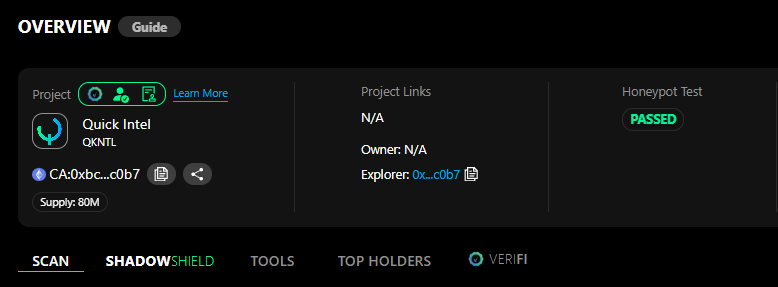
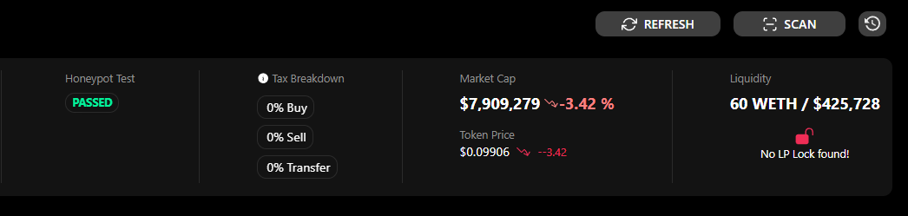

# 💲 Token Details

### Project Details

Once you have selected your token details to scan, it is now time to read those results and understand what's going on.

<figure><figcaption></figcaption></figure>

1. Pertinent token details will be listed here, including the contract name and address, the token's supply, the current owner, and a link to the explorer.\
   Additionally, if the token has a max wallet or max transaction limit, it will be listed here.

### Honeypot Test

<figure><figcaption></figcaption></figure>

1. With the Honeypot test, we simulate whether the token can be bought and sold when the scan is completed.&#x20;
2. Based on the simulation results, the buy, sell, and transfer taxes of that token are calculated so you can easily see how the taxes will affect your buys and sells.
3. If the project locked its liquidity via one of the lock providers across the supported chains, this information will be listed here, along with the percentage locked and the unlock date.
4. (All Access Feature) If you are an All Access Tier holder, you will also receive an AI-detected confidence score from our in-house Quick Intel AI Scam prediction tool; it will predict the chances of that contract scamming you. This data is constantly evolving, should be used for educational purposes and research, and should not be used as the source of truth.

### Liquidity

Knowing the Liquidity information about a project is key to understanding how a buy or sell will affect that token. Adequate liquidity ensures you can buy and sell that token. Below, we break down the information displayed.

<figure><figcaption></figcaption></figure>

1. The total pairing of Liquidity in the pairing token and the $USD value.
2. The total current market cap of the token.
