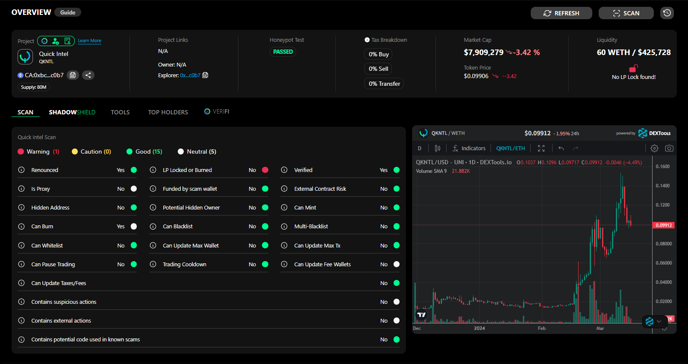

# Introduction


<mark style="color:yellow;">The quick Intel scanner is FREE to use for anyone.</mark>  \
\
<mark style="color:purple;">**NOTE:**</mark> There are [Tier Benefits](../qkntl-token/tiers-and-benefits.md) for the scanner if you are a QKNTL token holder, which provides enhanced information, data, and resources to make your DYOR easier and quicker.


## Quick Intel Scanner

How to access the scanner:

* Desktop / Mobile Web:  [https://app.quickintel.io/scanner](https://app.quickintel.io/scanner)
* Android App:  [Google Play Store](https://play.google.com/store/apps/details?id=webviewgold.quickintel)
* IOS App:  [Apple App Store](https://apps.apple.com/app/id6454298521)
* Discord / Telegram Bot:  [Bot Documents](../developer-integration/discord-tg-bots/)

<figure><figcaption>
Quick Intel Scanner
</figcaption></figure>

The Quick Intel Scanner is a vital component of the comprehensive scan results, designed to offer a succinct yet deep analysis of smart contracts. This rapid assessment aims to pin down essential characteristics and operational aspects of a contract to assist users in determining its safety and integrity. Here's what the Quick Intel Audit encompasses:

* **Rapid Analysis**: Leveraging sophisticated algorithms, the audit quickly filters through the contract's code, pinpointing crucial information that helps in evaluating its trustworthiness.
* **Safety Checks**: It scrutinizes the contract for common security concerns and flags any potential risks, providing users with peace of mind regarding their digital assets.
* **Hidden Action Identification**: One of the core features of the Quick Intel Audit is its ability to detect obscure or concealed actions within the contract. This is pivotal for users to understand any hidden functionalities that could be potentially harmful or not in line with the user's expectations.
* **Transparency and Clarity**: The findings from the audit are presented in an easy-to-understand format, allowing even those with minimal technical background to grasp the nuances of the contract under scrutiny.
* **Quick Decision Making**: By offering a concise yet detailed overview of key contract aspects, the Quick Intel Audit empowers users to make informed decisions swiftly—whether to proceed with caution, take corrective measures, or deem the contract safe for use.

Incorporating the Quick Intel Scanner as part of your contract analysis routine elevates your ability to navigate the complex landscape of digital contracts with greater confidence and security.

Jump into the guides to learn more!


[get-started-guides](get-started-guides/)

