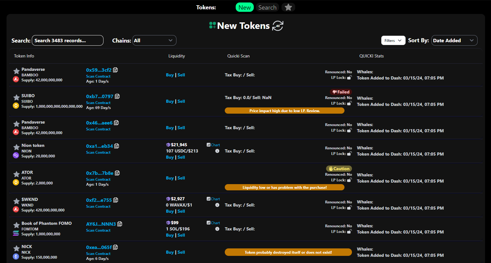

# Launch Dashboard

The Quick Intel Dashboard is an innovative way for traders to get key information as a one-stop shop on projects launching across multiple chains.

<figure><figcaption>
Quick Intel "New Token" Dashboard
</figcaption></figure>


Note that the dashboard is a <mark style="color:yellow;">benefit of being an All Access tier holder.</mark> &#x20;

Learn more about Quick Intel tier benefits at: [tiers-and-benefits.md](../qkntl-token/tiers-and-benefits.md "mention")


## Quick Intel Launch Dashboard: Your Multi-Chain Trading Partner

The Quick Intel Dashboard revolutionizes the way traders access information on projects launching across various blockchain networks. It consolidates critical data into a single platform, offering immediate insights into newly launched tokens —saving traders time and enabling more informed investment decisions.

### Core Features

* **Comprehensive Multi-Chain Coverage**: Offers insights across several major blockchain networks.
* **Real-Time Information**: Ensures users have the latest data to act on promptly.
* **User-Centric Design**: Easy navigation and integration with the Quick Intel scanner.

### Benefits for Traders

The dashboard levels the playing field by eliminating information asymmetry, providing all traders, regardless of their size, with the opportunity to make well-informed decisions quickly.

### Conclusion

For traders navigating the complex cryptocurrency market, the Quick Intel Dashboard is an indispensable tool that simplifies the process of finding key contract information in one accessible location.

With the Quick Intel Scan directly integrated into the Dashboard, users can get a holistic view of tokens quickly and easily!

