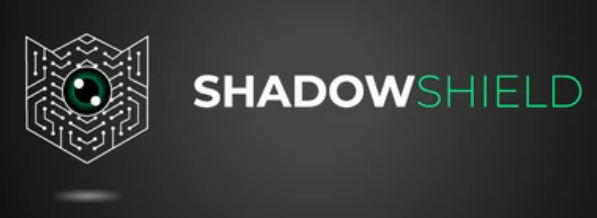
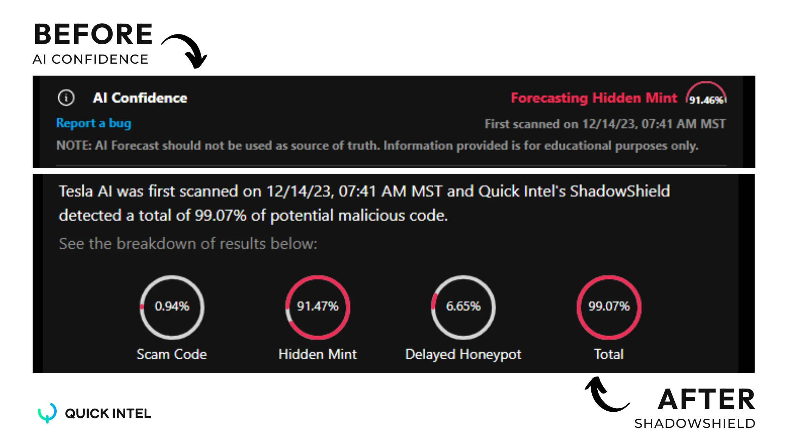

# ShadowShield AI

<figure><figcaption></figcaption></figure>

Ever feel like you're playing roulette with your crypto? Investing mindlessly into crypto projects is risky and not a game you want to play.

In the volatile world of cryptocurrency, a network of scammers lurk, ready to strike on those lured by dreams of easy wealth and vanish with your hard-earned money.

But what if you had a way to see the unseen, to see the vulnerabilities in smart contracts that are often hidden or easily overlooked? The stuff scammers don't want you to see.

Well, now you can - Introducing ShadowShield!

## **What Is ShadowShield?**

<mark style="color:yellow;">**ShadowShield is Quick Intel’s anti-scam solution for protecting your crypto. Think of it like an X-ray**</mark> <mark style="color:yellow;">**for smart contracts.**</mark> It detects hidden vulnerabilities in smart contracts that may not be visible to the naked eye.

### _How it Works:_

ShadowShield leverages artificial intelligence to analyze over 500,000 smart contracts, meticulously dissecting their code and identifying red flags that hint at potential scams.

This vast data pool fuels our AI to discern patterns and anomalies that often characterize fraudulent contracts. ShadowShield then predicts the likelihood of a smart contract being a scam. No more hidden scams, no more lost crypto!

Sound familiar? Originally launched in beta in May of 2023, you may know this as our AI Confidence tool. But not only have we changed the name, we've revamped it.

<figure><figcaption>
Quick Intel's ShadowShield AI
</figcaption></figure>

Instead of just one indicator that tells you the probability of it being a scam, now you have four: Scam Code, Hidden Mint, Delayed Honeypot, and Total Probability.

## **How Does ShadowShield Protect You?**

**Real-time Scam Detection:** Instantly receive a red flag or green light on any smart contract you encounter, ensuring you only interact with secure and legitimate projects.

**In-Depth Analysis:** Investigate thoroughly with detailed reports that break down the potential risks of each contract, providing you with the knowledge to make informed choices.

**Constant vigilance:** Crypto never sleeps, so neither does ShadowShield. Its AI engine continuously monitors the ever-changing landscape of smart contracts, proactively identifying new scams and updating its database to keep you ahead of the curve.

## **How Do I Access?**&#x20;

**ShadowShield is included in the Quick Intel's** [**All Access Tier**](../qkntl-token/tiers-and-benefits.md)**.** If you're already an All Access member, go to [the scanner](https://app.quickintel.io/scanner) and click on the ShadowShield tab of the scan results.

Not a member yet? [See what other benefits are available in the Quick Intel All Access tier!](../qkntl-token/tiers-and-benefits.md)\

With ShadowShield in your pocket, you can confidently navigate the crypto-verse, knowing that your investments are shielded from the lurking shadows of scams using the watchful eye of AI protection.
