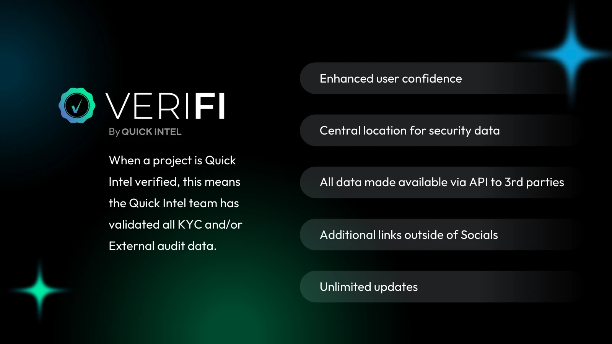
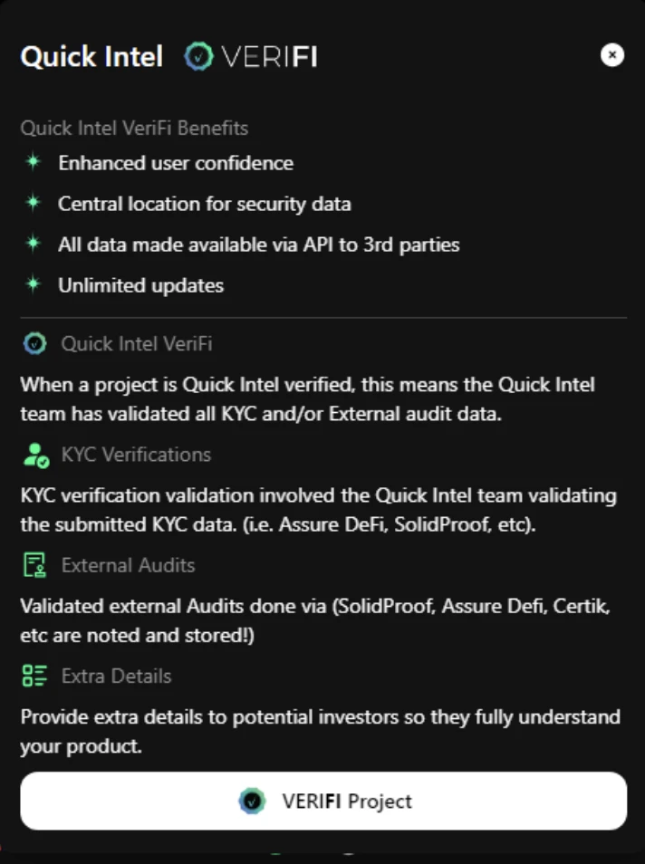

# VeriFi - Project Info

<figure><figcaption></figcaption></figure>


<mark style="color:yellow;">VeriFi data is FREE for Quick Intel Scanner Users (and API subscribers) to view.</mark>

\
<mark style="color:orange;">VeriFI is an optional, paid service that projects may choose to leverage.</mark>


## **What Is VeriFi?**

VeriFi is an optional, paid premium service that empowers developers to showcase their project's security and compliance, fostering trust and informed decision-making among potential investors.

VeriFi offers a one-stop solution for:

* **Enhanced User Confidence:** Build trust with a centralized location for all your project's security data.
* **Seamless Data Management:** Update your information effortlessly with unlimited accessibility.
* **API Integration:** Reach a wider audience through our existing API network serving over 10 million calls weekly.
* **Comprehensive Showcase:** Include KYC, audits, links, and project descriptions alongside your free scanner data.

**Showcasing the Complete Picture:** VeriFi seamlessly integrates your project details with our free scanner results, which industry leaders already trust.

Your investors are already using our tools. Let us help you show them the complete picture!

<figure><figcaption></figcaption></figure>

## **How Does It Work?**

When a project is Quick Intel verified, the Quick Intel team has validated all KYC and/or external audit data. After successful data validation, you'll receive the VeriFi badge, a trusted symbol of your commitment to transparency for your community and potential investors.

<figure><figcaption></figcaption></figure>

## **How To Get VeriFi'd?**

Sign up to get your project Quick Intel VeriFi'd in 3 easy steps:\
\
1\. Visit [https://support.quickintel.io/verifi](https://support.quickintel.io/verifi) to submit your project information.\
2\. Follow the provided instructions for payment and required information to avoid delays. You can also see a list of the KYC and Audit companies we support before sending payment to ensure we accept that source.\
3\. Get your information into the hands of potential investors quickly and easily.
